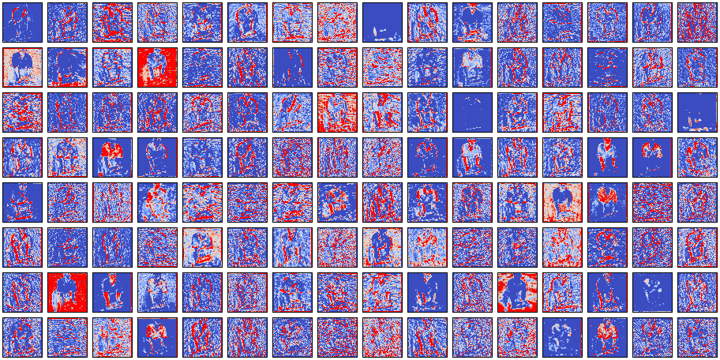
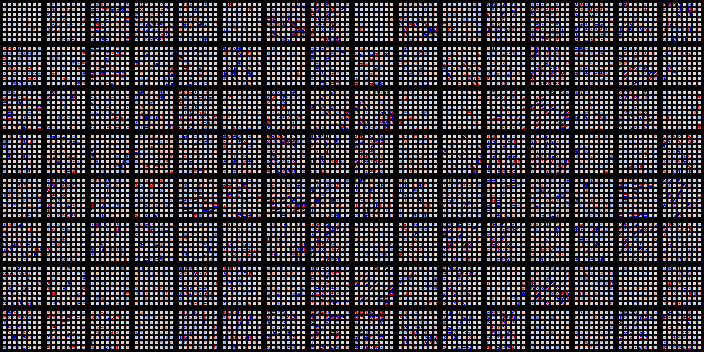
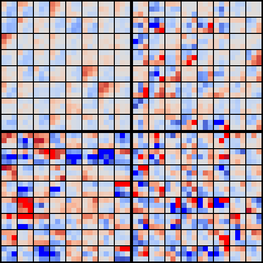

❤️ Lovely Tensors
================

<!-- WARNING: THIS FILE WAS AUTOGENERATED! DO NOT EDIT! -->

## Read full docs [here](https://xl0.github.io/lovely-tensors/)

## Install

``` sh
pip install lovely-tensors
```

## How to use

How often do you find yourself debugging PyTorch code? You dump a tensor
to the cell output, and see this:

``` python
numbers
```

    [[[-0.3541, -0.3369, -0.4054,  ..., -0.5596, -0.4739,  2.2489],
      [-0.4054, -0.4226, -0.4911,  ..., -0.9192, -0.8507,  2.1633],
      [-0.4739, -0.4739, -0.5424,  ..., -1.0390, -1.0390,  2.1975],
      ...,
      [-0.9020, -0.8335, -0.9363,  ..., -1.4672, -1.2959,  2.2318],
      [-0.8507, -0.7822, -0.9363,  ..., -1.6042, -1.5014,  2.1804],
      [-0.8335, -0.8164, -0.9705,  ..., -1.6555, -1.5528,  2.1119]],

     [[-0.1975, -0.1975, -0.3025,  ..., -0.4776, -0.3725,  2.4111],
      [-0.2500, -0.2325, -0.3375,  ..., -0.7052, -0.6702,  2.3585],
      [-0.3025, -0.2850, -0.3901,  ..., -0.7402, -0.8102,  2.3761],
      ...,
      [-0.4251, -0.2325, -0.3725,  ..., -1.0903, -1.0203,  2.4286],
      [-0.3901, -0.2325, -0.4251,  ..., -1.2304, -1.2304,  2.4111],
      [-0.4076, -0.2850, -0.4776,  ..., -1.2829, -1.2829,  2.3410]],

     [[-0.6715, -0.9853, -0.8807,  ..., -0.9678, -0.6890,  2.3960],
      [-0.7238, -1.0724, -0.9678,  ..., -1.2467, -1.0201,  2.3263],
      [-0.8284, -1.1247, -1.0201,  ..., -1.2641, -1.1596,  2.3786],
      ...,
      [-1.2293, -1.4733, -1.3861,  ..., -1.5081, -1.2641,  2.5180],
      [-1.1944, -1.4559, -1.4210,  ..., -1.6476, -1.4733,  2.4308],
      [-1.2293, -1.5256, -1.5081,  ..., -1.6824, -1.5256,  2.3611]]]

Was it really useful for you, as a human, to see all these numbers?

What is the shape? The size?  
What are the statistics?  
Are any of the values `nan` or `inf`?  
Is it an image of a man holding a tench?

``` python
import lovely_tensors as lt
```

``` python
lt.monkey_patch()
```

## `__repr__`

``` python
numbers # torch.Tensor
```

    tensor[3, 196, 196] n=115248 x∈[-2.118, 2.640] μ=-0.388 σ=1.073

Better, huh?

``` python
numbers[1,:6,1] # Still shows values if there are not too many.
```

    tensor[6] x∈[-0.443, -0.197] μ=-0.311 σ=0.091 [-0.197, -0.232, -0.285, -0.373, -0.443, -0.338]

``` python
spicy = numbers.flatten()[:12].clone()

spicy[0] *= 10000
spicy[1] /= 10000
spicy[2] = float('inf')
spicy[3] = float('-inf')
spicy[4] = float('nan')

spicy = spicy.reshape((2,6))
spicy # Spicy stuff
```

    tensor[2, 6] n=12 x∈[-3.541e+03, -3.369e-05] μ=-393.776 σ=1.180e+03 +inf! -inf! nan!

``` python
torch.zeros(10, 10) # A zero tensor - make it obvious
```

    tensor[10, 10] n=100 all_zeros

``` python
spicy.v # Verbose
```

    tensor[2, 6] n=12 x∈[-3.541e+03, -3.369e-05] μ=-393.776 σ=1.180e+03 +inf! -inf! nan!
    [[-3.5405e+03, -3.3693e-05,         inf,        -inf,         nan, -4.0543e-01],
     [-4.2255e-01, -4.9105e-01, -5.0818e-01, -5.5955e-01, -5.4243e-01, -5.0818e-01]]

``` python
spicy.p # The plain old way
```

    [[-3.5405e+03, -3.3693e-05,         inf,        -inf,         nan, -4.0543e-01],
     [-4.2255e-01, -4.9105e-01, -5.0818e-01, -5.5955e-01, -5.4243e-01, -5.0818e-01]]

## Going `.deeper`

``` python
numbers.deeper
```

    tensor[3, 196, 196] n=115248 x∈[-2.118, 2.640] μ=-0.388 σ=1.073
      tensor[196, 196] n=38416 x∈[-2.118, 2.249] μ=-0.324 σ=1.036
      tensor[196, 196] n=38416 x∈[-1.966, 2.429] μ=-0.274 σ=0.973
      tensor[196, 196] n=38416 x∈[-1.804, 2.640] μ=-0.567 σ=1.178

``` python
# You can go deeper if you need to
numbers[:,:3,:5].deeper(2)
```

    tensor[3, 3, 5] n=45 x∈[-1.316, -0.197] μ=-0.593 σ=0.306
      tensor[3, 5] n=15 x∈[-0.765, -0.337] μ=-0.492 σ=0.124
        tensor[5] x∈[-0.440, -0.337] μ=-0.385 σ=0.041 [-0.354, -0.337, -0.405, -0.440, -0.388]
        tensor[5] x∈[-0.662, -0.405] μ=-0.512 σ=0.108 [-0.405, -0.423, -0.491, -0.577, -0.662]
        tensor[5] x∈[-0.765, -0.474] μ=-0.580 σ=0.125 [-0.474, -0.474, -0.542, -0.645, -0.765]
      tensor[3, 5] n=15 x∈[-0.513, -0.197] μ=-0.321 σ=0.099
        tensor[5] x∈[-0.303, -0.197] μ=-0.243 σ=0.055 [-0.197, -0.197, -0.303, -0.303, -0.215]
        tensor[5] x∈[-0.408, -0.232] μ=-0.327 σ=0.084 [-0.250, -0.232, -0.338, -0.408, -0.408]
        tensor[5] x∈[-0.513, -0.285] μ=-0.394 σ=0.102 [-0.303, -0.285, -0.390, -0.478, -0.513]
      tensor[3, 5] n=15 x∈[-1.316, -0.672] μ=-0.964 σ=0.176
        tensor[5] x∈[-0.985, -0.672] μ=-0.846 σ=0.123 [-0.672, -0.985, -0.881, -0.776, -0.916]
        tensor[5] x∈[-1.212, -0.724] μ=-0.989 σ=0.179 [-0.724, -1.072, -0.968, -0.968, -1.212]
        tensor[5] x∈[-1.316, -0.828] μ=-1.058 σ=0.179 [-0.828, -1.125, -1.020, -1.003, -1.316]

## Now in `.rgb` color

The important queston - is it our man?

``` python
numbers.rgb
```


*Maaaaybe?* Looks like someone normalized him.

``` python
in_stats = ( (0.485, 0.456, 0.406),     # mean 
             (0.229, 0.224, 0.225) )    # std

# numbers.rgb(in_stats, cl=True) # For channel-last input format
numbers.rgb(in_stats)
```


It’s indeed our hero, the Tenchman!

## `.plt` the statistics

``` python
(numbers+3).plt
```


``` python
(numbers+3).plt(center="mean", max_s=1000)
```


``` python
(numbers+3).plt(center="range")
```


## See the `.chans`

``` python
# .chans will map values betwen [0,1] to colors.
# Make our values fit into that range to avoid clipping.
mean = torch.tensor(in_stats[0])[:,None,None]
std = torch.tensor(in_stats[1])[:,None,None]
numbers_01 = (numbers*std + mean)
numbers_01
```

    tensor[3, 196, 196] n=115248 x∈[0., 1.000] μ=0.361 σ=0.248

``` python
numbers_01.chans
```


Let’s try with a Convolutional Neural Network

``` python
from torchvision.models import vgg11, VGG11_Weights
```

``` python
features = vgg11().features

# Note: I only saved the first 5 layers in "features.pt"
_ = features.load_state_dict(torch.load("../features.pt"), strict=False)
```

``` python
# Activatons of the second max pool layer of VGG11
print(features[5])

acts = (features[:6](numbers[None])[0]/2) # /2 to reduce clipping
acts
```

    MaxPool2d(kernel_size=2, stride=2, padding=0, dilation=1, ceil_mode=False)

    tensor[128, 49, 49] n=307328 x∈[0., 12.508] μ=0.367 σ=0.634 grad DivBackward0

``` python
acts.chans
```



## Without `.monkey_patch`

``` python
lt.lovely(spicy)
```

    tensor[2, 6] n=12 x∈[-3.541e+03, -3.369e-05] μ=-393.776 σ=1.180e+03 +inf! -inf! nan!

``` python
lt.lovely(spicy, verbose=True)
```

    tensor[2, 6] n=12 x∈[-3.541e+03, -3.369e-05] μ=-393.776 σ=1.180e+03 +inf! -inf! nan!
    [[-3.5405e+03, -3.3693e-05,         inf,        -inf,         nan, -4.0543e-01],
     [-4.2255e-01, -4.9105e-01, -5.0818e-01, -5.5955e-01, -5.4243e-01, -5.0818e-01]]

``` python
lt.lovely(numbers, depth=1)
```

    tensor[3, 196, 196] n=115248 x∈[-2.118, 2.640] μ=-0.388 σ=1.073
      tensor[196, 196] n=38416 x∈[-2.118, 2.249] μ=-0.324 σ=1.036
      tensor[196, 196] n=38416 x∈[-1.966, 2.429] μ=-0.274 σ=0.973
      tensor[196, 196] n=38416 x∈[-1.804, 2.640] μ=-0.567 σ=1.178

``` python
lt.rgb(numbers, in_stats)
```


``` python
lt.plot(numbers, center="mean")
```



``` python
lt.chans(numbers_01)
```


